# Adesso Case Proje için çalıştırma adımları

## 1. Clonelama

1. Bilgisayarınızda `Windows + r` ardından cmd yazarak Komut satırını açınız.  
2. Açtığınız arayüzde istediğiniz bir lokasyona gidiniz.  
3. Bulunduğunuz konuma `git clone https://github.com/Emopusta/adesso-case` yazınız.  

## 2. Gerekli konfigurasyonlar ve Veri tabanı oluşturma

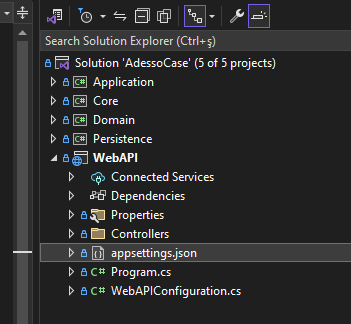

1. Resimde görülen appsettings klasörünün içinde kendi localinizde çalışmasını istediğiniz veri tabanı stringini giriniz.
2. Ardından ayarlardan açılan Package Manager Console'u açınız.
3. Açılan konsolda Default Project olarak Persistence katmanını seçmeyi unutmayınız!

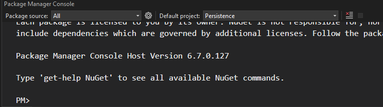

4. Ardından konsola `update-database` yazınız.
5. SQL Server Object Explorer yardımı ile oluşturduğunuz veri tabanına ulaşabilirsiniz.
6. Not: Veriler seedler yardımı ile Persistence katmanındaki configurasyon dosyaları içerisinden otomatik olarak oluşturulmuştur. (team ve country)

## 3. Build ve Çalışma

1. İlk olarak WebApi üzerine sağ tıkladıktan sonra projemizi başlangıç projesi olarak seçelim.
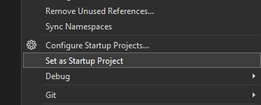

2. Ardından yukarıdaki oynat butonuna tıklayalım.

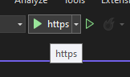

3. Önümüze swagger UI gelecek

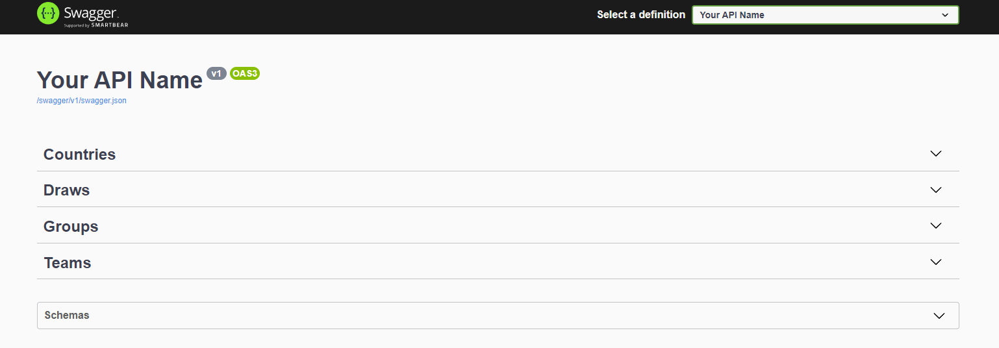

## 4. Simülasyon

1. İlk olarak hazır bir şekilde oluşturulmuş takımlar için grup oluşturmamız gerekiyor.
2. Groups Endpointi altında `/api/Groups/CreateGroups` ile 4 ila 8 sayıda grup oluşturup bu gruplara isim ataması yapınız.
3. oluşan grupları cevapta görebilirsiniz.

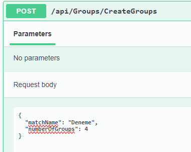
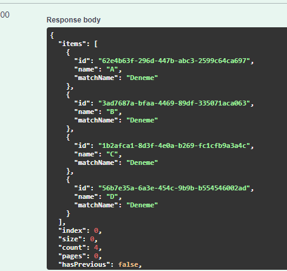

4. Ardından `/api/Draws/pickAll` endpointi ile bütün oluşturulan grupların ilgili gruplara dağılması sağlanır.
5. picker yani kurayı çeken kişinin ismidir.
6. MatchName ise oluşturulan grubun ismidir, Önceki oluşturduğunuz gruplarla aynı ismi yazdığınızdan emin olunuz.

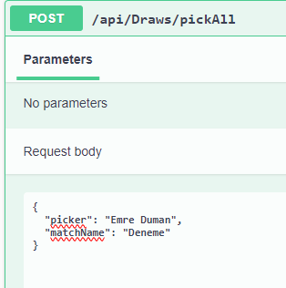
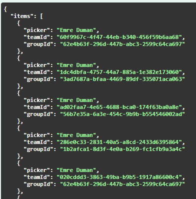

7. son olarak oluşturulan gruplarda yapılan kura ile ayrık olarak listelenen takımları `/api/Groups/getAllWithTeams` end pointi ile görüntüleyebilirsiniz

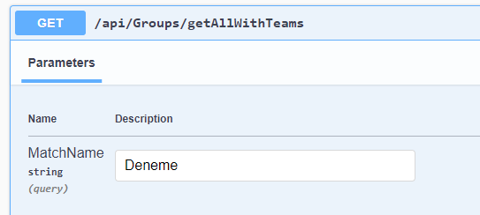
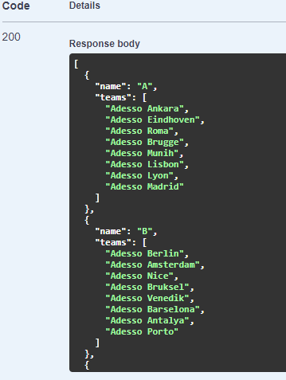